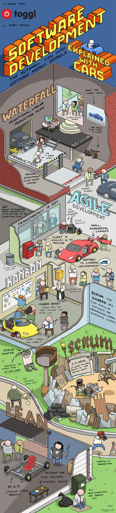

> 
>
> Why software development can sometimes be difficult
>
> > 우리가 하는 건 스크럼. 스크럼!  
> > 그림이 정말 구구절절 와닿음. ㅠㅠ 

> <http://slownews.kr/52777>
>
> 초단타매매 ‘완전 범죄의 탄생’, [플래시 보이스]

> <http://www.nytimes.com/2016/03/28/t-magazine/silicon-valley-google-apple-1960s-architecture.html?smprod=nytcore-iphone&smid=nytcore-iphone-share&_r=0>
>
> Google and Apple: the High-Tech Hippies of Silicon Valley

> <http://hankookilbo.com/m/v/11e08cf87ccb44cb8ec55a59ff60d961>
>
> “여성의 징병제도의 면제는 혜택이 아니라, 장애인이 ‘국민’에서 배제되는 방식과 같다. (아직도 부정하는 사람들이 많지만 7년간의 소송 끝에 ‘군 가산점 제도’를 폐지한 것은 남성 장애인이다.) 여성 전용 주차장 같은 공간은 납치와 강간 위험 때문에 마련된 것이지 혜택이 아니다."

> <http://xcendo.net/2016/03/googletranslate/>
>
> 번역계의 알파고는 언제 나올까: 구글딥마인드와 구글번역
>
> > “놀라운 사실은 구글번역이 문법규칙을 활용하지 않는다는 것이다. 두 언어 사이의 번역된 문서를 축적해놓은 거대한 ‘로제타스톤’ 코퍼스에 담겨 있는 광대한 데이터베이스를 학습하여 전반적인 번역언어쌍에 적용할 수 있는 패턴을 만들어낸다."
> >
> > “구글번역의 기본 데이터베이스가 되는 자료는 UN이 생산해내는 공식문서다. UN에서는 6가지 언어 – 영어, 스페인어, 프랑스어, 중국어, 아랍어, 러시아어 – 를 공식 언어로 사용하는데, 그에 따라 모든 공식문서는 6가지 언어로 만들어진다. 그래서 구글번역은 이 6가지 언어는 직접 번역을 하며, 이 6가지 언어끼리 번역할 때 가장 뛰어난 결과물을 만들어낸다." 

> <http://yoonjiman.net/2016/03/09/women-dont-need-to-have-periods/>
>
> 여성들은 생리를 할 필요가 없습니다
>
> > 코니 윌리스의 '여왕마저도' 가 현실로. 하하하.

> <http://newzmagazine.com/dads-daughter-left-room-looks-son-law-realizes-sad-truth/>
>
> Dad’s Daughter Left The Room, Then He Looks At His Son-In-Law And Realizes The Sad Truth
>
> > 인도 광고. 딸 집에 방문한 아빠가 딸과 사위가 사는 모습을 보고 자신을 반성하기 시작.

> <http://shinseungkeon.com/2016/04/03/로봇의-부상/>
>
> > "저자는 나름의 고민과 연구 끝에 ‘기본소득 보장제도’를 제안했지만, 나는 이에 동의하지 않는다. ‘기본소득 보장제도’가 궁극적인 해법이 될 수 없을 것이라고 생각한다. 만약에 ‘기본소득 보장제도’가 실현된다면, 우리가 중요하게 여기는 가치 가운데 한 가지를 잃게 될 것이라고 생각한다.
> > ...
> > 요컨대 저자가 주장하는 ‘기본소득 보장제도’는 결국 민주주의를 무너뜨릴 것이다. 이는 중동의 산유국 가운데 국민들에게 생활비를 나눠주고 왕권도 유지하는 몇몇 국가들의 사례를 보면 쉽게 이해할 수 있다. 다만 그 산유국의 왕들은 석유에 권력의 기반을 두고 있기 때문에 석유 시설과 기업만 잘 통제하면 된다. 굳이 국민을 쥐어짤 필요는 없다."
> >
> > '기본소득 보장제도'는 상당히 복잡한 생각거리를 수반함.

> <http://news.naver.com/main/read.nhn?mode=LSD&mid=sec&oid=011&aid=0002814202&sid1=001>
>
> 마지막 전투기 파일럿

> <http://m.blog.naver.com/swsong33/220672924144>
>
> 실리콘벨리식 경영이란
>
> > “200년 전에는 모두가 장인처럼 일했습니다. 하지만 규모의 효율성은 부족했습니다. 산업화 시대에는 규모의 효율성은 높아졌지만 장인적 재능은 잃어버렸습니다. 앞으로 소셜 시대에는 개인의 능력을 유지하면서도 규모의 효율도 높일 수 있는 시대가 될 것이라고 생각합니다.”

> <https://developers.google.com/web/updates/2015/07/interact-with-ble-devices-on-the-web>
>
> Interact with BLE devices on the Web
>
> > 웹브라우저로 브레이든 프로와 통신할 경우 PC 애플리케이션이 필요 없음. 이왕 유료화 하려면 이 정도는 해줘야지. 서버 활용은 물론 PC에서 사용도 가능해진다면 돈을 지불할만할 듯.

> <http://blog.daum.net/irepublic/7889060>
>
> 도시의 미래, 낡은 것의 미래

> <http://ppss.kr/archives/78153>
>
> 그들이 파나마 페이퍼를 보도하는 법

> <http://slownews.kr/47590>
>
> 임박한 한국 자동차 산업의 몰락

> <http://slownews.kr/53421>
>
> 임박한 한국 자동차 산업의 몰락 2
>
> > 지금까지 유럽과 일본, 한국이 자동차 산업의 중심에 속했다면 앞으로는 미국과 중국으로 넘어갈 수도 있을듯. 혁신가의 딜레마에서 벗어나기는 쉽지 않음. 

> <http://ppss.kr/archives/15830>
>
> 한국인들이 에세이 영작을 못하는 이유
>
> > 당연하겠지만, 이건 외국어라서가 아니라 글을 쓰는 훈련 자체가 되지 않았기에 봉착하는 어려움

> <http://slownews.kr/53578>
>
> 1,700개의 스위처: 하드웨어 스타트업이 1,700개의 제품을 생산할 수 있었던 네 가지 단계
>
> > 금형에 대해 지금까지 어렴풋이 알고 있던 몇 가지 용어를 제대로 알게 되었음. 

> <http://newspeppermint.com/2016/04/17/teacherswrognanswers/>
>
> 학생이 쉽게 틀리는 오답이 무언지 선생님이 알아야 하는 이유

> <http://animagraffs.com/how-a-car-engine-works/>
>
> How a Car Engine Works

> <http://humandrama.tistory.com/1471>
>
> 독일 리콜 조치에 BMW만 빠진 이유

> <http://www.slideshare.net/Byungwook/jira-61442816>
>
> 애자일 스크럼과 JIRA

> <http://slowalk.tistory.com/2382>
>
> 슬로워크 입사지원서 설계 이야기

> <http://slowalk.tistory.com/2373>
>
> 움직이는 집, 미래의 대안이 될 수 있을까?

> <http://www.huffingtonpost.kr/2016/04/27/story_n_9785192.html>
>
> 다이슨이 헤어드라이어 '슈퍼소닉'을 공개하다

> <http://newspeppermint.com/2016/04/28/beingtired/>
>
> “하루에 16시간씩 일하는 건 자랑이 아닙니다.”

> <http://newspeppermint.com/2016/04/26/brothers-one/>
>
> AP통신, 한국 정부에 의한 부랑자 집단 학대 및 학살 사건 은폐를 보도하다 (1)
>
> <http://newspeppermint.com/2016/04/27/brothers-two/>
>
> AP통신, 한국 정부에 의한 부랑자 집단 학대 및 학살 사건 은폐를 보도하다 (2)
>
> <http://newspeppermint.com/2016/04/28/brothers-three/>
>
> AP통신, 한국 정부에 의한 부랑자 집단 학대 및 학살 사건 은폐를 보도하다 (3) 