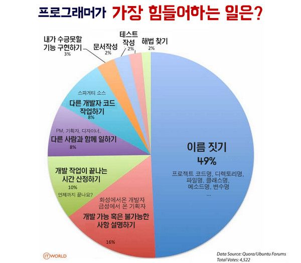

> [http://agile.egloos.com/5879231](http://agile.egloos.com/5879231)
>
> 퍼포먼스 공식
>
> > 플라톤에 따르면 ‘안다’라는 것은 ‘체화’에 가깝다. 손발을 움직이듯 자유롭게 다룰 수 있을 때 그것을 ‘안다’라고 할 수 있다. ‘알면서도 어떻게 그럴 수 있느냐’는 논리적으로 성립하지 않는다. 사실은 알지 못해서 잘못을 행하는 것이다. 교육의 목표는 알지 못하는 상태에서 아는 상태로 이전하는 것이어야 한다.

> [https://brunch.co.kr/@myong/45](https://brunch.co.kr/@myong/45)
>
> 급성장하는 스타트업은 미친 아이디어여야만 한다.

> [https://www.facebook.com/rasiel37/posts/1539477536068120](https://www.facebook.com/rasiel37/posts/1539477536068120)
>
> 카메라 선택과 관련한 살짝 독한 조언 몇가지

> [http://newspeppermint.com/2016/11/11/sorkinontrump/](http://newspeppermint.com/2016/11/11/sorkinontrump/)
>
> 애론 소킨이 트럼프 당선 뒤 딸에게 보낸 편지

> [http://www.ciokorea.com/news/31887](http://www.ciokorea.com/news/31887)
>
> 제가 이 일을 왜 해야 합니까? – 오너십과 리더십

> [https://www.g-mark.org/activity/2016/best100.html](https://www.g-mark.org/activity/2016/best100.html)
>
> 2016 Good design best 100

> [http://ppss.kr/archives/86635](http://ppss.kr/archives/86635)
>
> 색연필 과학만화 : 양자역학

> [http://weekly.donga.com/List/Series/3/990436/11/779340/1](http://weekly.donga.com/List/Series/3/990436/11/779340/1)
>
> 정치 부패와 국가 경제의 상관관계
>
> > “그렇다면 어떨 때 부패가 경제에 도움이 되는 것일까. 복잡한 논의가 있지만 여러 사회과학 연구 결과를 요약하면 제도적 체계가 제대로 갖춰지지 않은 국가에서는 부패가 경제발전에 도움이 된다. 반면 국가 기틀이 잡힌 경우에는 부패가 경제발전에 방해가 된다.”
> >
> > 주로 동의. 하지만 후진국에서조차 경제에 도움이 되는 부패 정도는 개인의 자산 축적 동기에 방해를 주지 않는 한도 이내로 제한되어야 한다.

> [https://madscientist.wordpress.com/2016/11/16/매일-한-시간씩-논문-쓰기/](https://madscientist.wordpress.com/2016/11/16/매일-한-시간씩-논문-쓰기/)
>
> 매일 한 시간씩 논문 쓰기
>
> > "내가 깨달은 것은 논문 쓰는 것은 방해받지 않고 오랜 동안 쓸 필요가 없다는 것이다. 집중과 규칙이 제일 중요하다.”

> [http://slowalk.tistory.com/2460](http://slowalk.tistory.com/2460)
>
> 인권의 눈으로 입사지원서 뜯어보기

> [http://slownews.kr/60080](http://slownews.kr/60080)
>
> 대통령이 맞았다는 그 줄기세포주사

> [http://verticalplatform.kr/archives/8306](http://verticalplatform.kr/archives/8306)
>
> IoT 시장은 어디로 가고 있나?

> [http://newspeppermint.com/2016/11/27/m-murder/](http://newspeppermint.com/2016/11/27/m-murder/)
>
> 가상현실에서의 살인은 금지되어야 합니다

> [http://flyhendrixfly.net/이론의-종말-데이터-홍수가-과학적-연구방법을-구닥/](http://flyhendrixfly.net/이론의-종말-데이터-홍수가-과학적-연구방법을-구닥/)
>
> 이론의 종말: 데이터 홍수가 과학적 연구방법을 구닥다리로 만든다

> [http://techneedle.com/archives/29063](http://techneedle.com/archives/29063)
>
> 아마존이 창고에 상품을 뒤죽박죽 보관하는 이유

> [http://blog.naver.com/hong8706/220877713716](http://blog.naver.com/hong8706/220877713716)
>
> 남자의 종말 - 왜 미국 백인 남자는 힐러리 대신 트럼프를 찍었을까
>
> > 이 분석은 상당히 설득력이 있음. 큰 선거일수록 자신의 이익보다는 자신의 정체성을 대표하는 쪽에 투표하는 경향이 높음.

