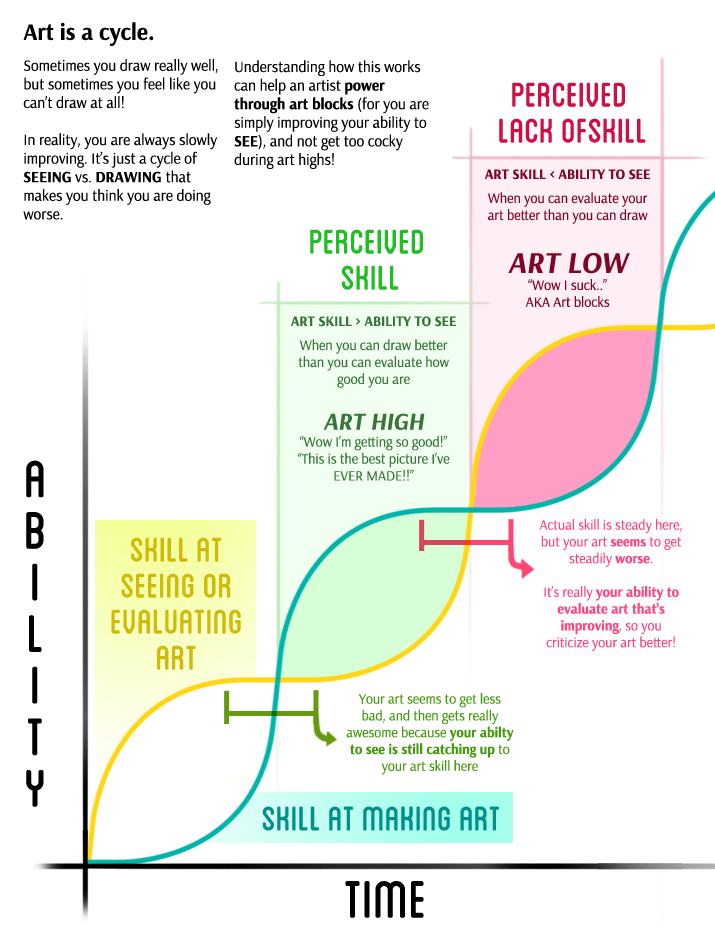

### 2017년 3월
> http://lovos.egloos.com/3198320
>
> "you"의 의미

> http://m.ize.co.kr/view.html?no=2017032300177292568
>
> 홍상수의 한심한 남자들

> https://brunch.co.kr/@younghakjang/4
>
> 수평적 조직문화 테스트
>
> https://brunch.co.kr/@younghakjang/5
>
> 수평적 조직문화가 꼭 좋은 걸까?

> http://techneedle.com/archives/29941
>
> [특집] 프로에게 묻다. 블록체인이 뭔가요?
>
> > "미래에는 로봇이 회사를 운영하며, 로봇이 로봇을 고용하고, 로봇이 가치를 만들어내며, 로봇과 로봇, 로봇과 인간이 서로 가치를 주고 받게 됩니다.
> > 스케일체인은 이러한 패러다임 변화에 대비하여 딥러닝을 블록체인 노드로 분산처리할 수 있는 가상화폐를 개발하고 운영하는 회사입니다. 조만간 테스트버전을 론칭할 계획이며, 가상화폐 판매와 블록체인상의 거래 수수료로 수익을 창출합니다."

> http://bcho.tistory.com/1164
>
> 구글의 IOT 솔루션

> http://www.inven.co.kr/webzine/news/?news=174334&sw=애자일
>
> [인터뷰] 효과적인 프로젝트 관리법, 애자일! '애자일의 신'으로 즐기면서 배우세요

> http://www.huffingtonpost.kr/2017/03/19/story_n_15464090.html
>
> 서울대생이 50만 원씩 내고 전공 보충 학원에 다니는 이유(영상)

> https://brunch.co.kr/@rhodia/98
>
> 착한 키즈노트의 나쁜 수익

> http://m.thescoop.co.kr/news/articleView.html?idxno=22714#_enliple
>
> 리더는 본디 외롭다, 동정 구하지 말라

> http://electronics360.globalspec.com/article/6887/the-rtos-in-2016
>
> The RTOS in 2016
> > “I think they’re starting to “get it.” For example, there’s a huge shift now from the 8-bit processors to 32-bit processors. There were only two 8-bit processor manufacturers in the world. Atmel had ADRs and Microchip, 8-bit PICs. Now with Microchip’s acquisition of Atmel, 8-bit processors will all come from a single source. Microchip is also well positioned for the 32-bit ARM-based product line. As soon as you add a 32-bit processor to a design, you need an RTOS. Because this processor is capable of a lot more performance and processing power than an 8-bit solution, then the question is, which RTOS?"

> http://thevalues.kr/220939540235
>
> 직원에게 매력 있는 회사가 되려면 EVP(Employee Value Proposition)에 관심을 가져라

> http://www.hankookilbo.com/m/v/ba24ff26143e45369caa566bc4988a58
>
> 설민석, 한병철, 그리고 도취의 언어
>
> - “언어의 내용을 떠나, 도취된 언어에 취약한 사회는 민주주의가 취약한 사회라 할 수밖에 없다."

> http://santa_croce.blog.me/220967595470
>
> 디지털 노마드를 꿈꾸었으나 사이버 게토에 갇혀버린 젊은이들

> http://www.moreagile.net/2014/01/timeboxing.html
>
> 프로젝트 관리 기법 - 타임박싱(Timeboxing) 관리 기법

> http://futuristicflamingo.tumblr.com/post/148847191906/eyecaging-creativity-expression-education-and
>
> Creativity, Expression, Education, and “The Dip”

> http://www.progressfocused.com/2016/05/the-dunning-kruger-ramp.html
>
> The Dunning-Kruger ramp

